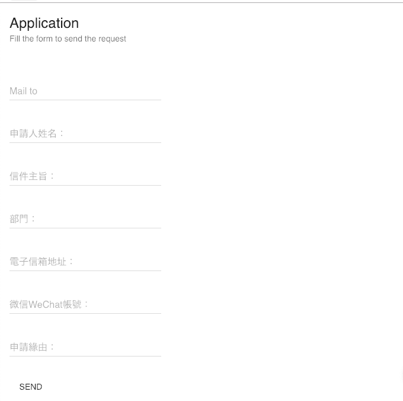

# Leopard Applicant

<br/>

A React-based web application that generates email application forms with a user-friendly interface.

**🌐 Live Demo:** [https://leopardapplicant.firebaseapp.com/](https://leopardapplicant.firebaseapp.com/)

## 📋 Overview

Leopard Applicant is a simple yet effective web form that helps users compose structured application emails. The application collects user information through a Material-UI form and generates a properly formatted `mailto` link for easy email submission.

## ✨ Features

- **User-friendly Form Interface**: Built with Material-UI components for a clean, professional look
- **Automatic Email Generation**: Creates properly formatted `mailto` links with structured content
- **Local Storage**: Automatically saves form data to prevent data loss
- **Responsive Design**: Works across different screen sizes
- **Bilingual Support**: Form labels in both English and Chinese/Traditional Chinese

## 📝 Form Fields

The application collects the following information:

- **收件人 (Mail To)**: Recipient email address
- **申請人姓名 (Applicant Name)**: Name of the person making the application
- **信件主旨 (Subject)**: Email subject line
- **部門 (Department)**: Department or organization
- **電子信箱地址 (Email Address)**: Applicant's email address
- **微信WeChat帳號 (WeChat ID)**: WeChat account ID
- **申請緣由 (Reason for Application)**: Description or reason for the application

## 🚀 Getting Started

### Prerequisites

- Node.js (version 14 or higher)
- npm or yarn package manager

### Installation

1. Clone the repository:
```bash
git clone https://github.com/yourusername/leopardapplicant.git
cd leopardapplicant
```

2. Install dependencies:
```bash
npm install
```

3. Start the development server:
```bash
npm start
```

4. Open [http://localhost:3000](http://localhost:3000) to view it in the browser.

## 🛠️ Available Scripts

- `npm start` - Runs the app in development mode
- `npm test` - Launches the test runner
- `npm run build` - Builds the app for production
- `npm run eject` - Ejects from Create React App (one-way operation)

## 🏗️ Built With

- **React** (16.2.0) - JavaScript library for building user interfaces
- **Material-UI** (0.20.0) - React components implementing Google's Material Design
- **jQuery** (3.3.1) - JavaScript library for DOM manipulation
- **Create React App** - Bootstrapped with Create React App for easy setup

## 📱 Deployment

This application is deployed on Firebase Hosting and can be accessed at:
[https://leopardapplicant.firebaseapp.com/](https://leopardapplicant.firebaseapp.com/)

To deploy your own version:

1. Build the production version:
```bash
npm run build
```

2. Deploy to Firebase (requires Firebase CLI setup):
```bash
firebase deploy
```

## 🎯 How It Works

1. **Fill the Form**: Users enter their information in the provided fields
2. **Auto-save**: Form data is automatically saved to browser's local storage
3. **Generate Email**: The app creates a structured email body with all the provided information
4. **Send**: Click the "SEND" button to open the default email client with the pre-filled email

## 📁 Project Structure

```
leopardapplicant/
├── public/
│   ├── icons/          # App icons in various sizes
│   ├── index.html      # HTML template
│   └── manifest.json   # PWA manifest
├── src/
│   ├── App.js          # Main application component
│   ├── App.css         # Application styles
│   ├── index.js        # Entry point
│   └── ...
├── pictures/
│   └── illustration.png # App illustration
├── package.json        # Dependencies and scripts
└── README.md          # This file
```

---

## Illustration
